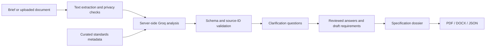

<div align="center">
  
  <h1>Bharat Samvida</h1>
  <p><strong>Clarity in every tender.</strong></p>
  <p>Turn everyday procurement needs into structured, evidence-backed specification drafts.</p>
  <p>
    <a href="https://bharat-samvida.netlify.app/">Live website</a> ·
    <a href="https://bharat-samvida.netlify.app/studio">Tender Studio</a> ·
    <a href="https://bharat-samvida.netlify.app/library">Legal Library</a>
  </p>
  <p><strong>Team Vincera · Smart India Hackathon · Problem Statement 26108</strong></p>
  <p>Next.js 15 · TypeScript · Groq · English / हिंदी</p>
</div>

---

## Why Bharat Samvida?

A school needs fresh paint. A neighbourhood needs reliable water pipes. A bridge needs materials that meet the right specifications. Before any of that work begins, someone has to write a clear tender.

Finding the relevant Indian Standards can be difficult: product scopes overlap, editions change, and supporting test methods or certification requirements can be easy to miss. Bharat Samvida helps procurement teams move from a plain-language description to a structured brief, targeted clarification questions, source-linked standard candidates, and a document they can review.

The project addresses **SIH Problem Statement 26108**, associated with the **Department of Consumer Affairs (DoCA), Ministry of Consumer Affairs, Food & Public Distribution**. It is an independent SIH project, not an official government or BIS service.

## Explore the experience

| Space | What you can do |
| --- | --- |
| **Home** | Follow a scroll-driven journey through school renovation, neighbourhood development, and bridge construction. |
| **Tender Studio** | Describe a requirement, upload a brief, answer clarification questions, and review a provisional specification. |
| **Legal Library** | Browse 44 curated legal and procurement documents by category, read PDFs inside the app, and download the originals. |

### Tender Studio

- **Write naturally.** Describe your procurement in English or Hindi, without needing to know a standard number first.
- **Bring an existing brief.** Upload searchable PDF, DOCX, or TXT files, up to 3 MB. PDF extraction supports up to 100 pages; extracted text is limited to 60,000 characters.
- **Clarify what matters.** Questions offer four choices, a custom answer, and an unknown option. Missing quantities, performance requirements, delivery details, and commercial context stay visible.
- **Review the evidence.** See suggested standard candidates, the reasons for their inclusion, source links, and explicit uncertainty.
- **Export your work.** Generate PDF, Word, or JSON outputs. Document exports include tender particulars, scope, technical requirements, quality checks, commercial terms, and a financial offer schedule.
- **Start without an account.** Work in an anonymous, temporary session and delete it when finished.

### A visual story of better procurement

The homepage connects three development scenes into one reversible scroll journey. Text and renovation stages follow scroll progress, while camera-style movement links each location. The current flight preview uses still artwork with animated transitions; it is not filmed drone footage or a true 360° scene.

Tender Studio uses a dotted emblem-to-orb loading sequence with three orb treatments. The interface adapts to phone, tablet, and desktop layouts.

### English and Hindi

Language selection persists across the interface. The library uses official Hindi material where available and offers labelled AI-assisted Hindi reading translations where supported. Original documents remain accessible. Scanned or unextractable pages may require the original PDF; translated reading pages are not official legal translations.

## Try a brief

> We need water-based paint for the dry interior plaster walls of a government primary school. Help us identify suitable standards, quality checks, and the details we should specify before inviting bids.

1. Open [Tender Studio](https://bharat-samvida.netlify.app/studio) and enter the brief.
2. Review the privacy scan and answer the clarification questions.
3. Check the suggested standards, supporting sources, and unresolved requirements.
4. Download a provisional document for technical and procurement review.

Use a sample brief when exploring the public demo.

## How it works



Groq interprets procurement intent against a curated standards catalogue. The server validates the output structure and filters candidate IDs against that catalogue. Clarification answers are applied to the server-owned draft before the final review step.

This implementation does **not** claim comprehensive BIS coverage, a verified normative-reference graph, automatic legal compliance, or continuously verified edition and amendment status. Certification applicability and current standards must be checked with the issuing authority. Unknown requirements remain unresolved rather than being filled with invented values. Exported documents are preparation drafts, not issued tenders.

## Technology

| Layer | Implementation |
| --- | --- |
| Application | Next.js App Router, React, TypeScript |
| Motion | GSAP, Three.js, Thinking Orbs, canvas and CSS |
| AI | Groq SDK with server-side model calls |
| Validation | Zod schemas and catalogue/source checks |
| Documents | PDF.js, pdf-parse, Mammoth, PDFKit, docx |
| Temporary storage | In-memory locally; encrypted Netlify Blobs on Netlify |
| Hosting | Netlify with the Next.js runtime adapter |

## Run locally

**Prerequisites:** Node.js 22, npm, and access to this repository. A Groq API key is needed for live AI mode.

```bash
git clone https://github.com/TeamVincera/bharat-samvida.git
cd bharat-samvida
npm ci
cp .env.example .env.local
```

Edit `.env.local` on your machine, then start the app:

```bash
npm run dev
```

Open [localhost:3000](http://localhost:3000).

### Environment variables

| Variable | Purpose |
| --- | --- |
| `APP_MODE` | Set to `live` for Groq analysis or `demo` for the built-in demo adapter. |
| `GROQ_API_KEY` | Your server-side Groq credential; required in live mode. |
| `GROQ_EXTRACTION_MODEL` | Initial analysis model. Default: `openai/gpt-oss-20b`. |
| `GROQ_RECOMMENDATION_MODEL` | Final review model. Default: `openai/gpt-oss-120b`. |
| `SESSION_STORAGE` | Set to `netlify` on Netlify; leave unset for local in-memory sessions. |
| `NEXT_TELEMETRY_DISABLED` | Set to `1` to disable Next.js telemetry. |

To explore without a Groq key, set `APP_MODE=demo`. Demo results are fixture-based examples, not live AI recommendations. Netlify storage depends on the hosting runtime; do not enable it for a plain local development server.

Never commit `.env.local`, paste credentials into issues, or prefix the Groq key with `NEXT_PUBLIC_`.

### Useful commands

```bash
npm test          # Acceptance and regression checks
npx tsc --noEmit  # Type checking
npm run build    # Production build
npm start        # Run the production build locally
```

Tests cover clarification handling, export validation, PDF/DOCX generation, session ownership and encryption, shared session storage, legal PDF hashes, and language/journey behaviour.

## Deploy to Netlify

The live site uses a **manual CLI deployment**. GitHub pushes do not automatically update it. This setup keeps the TeamVincera repository private without relying on a paid private-organization Git integration.

For a maintainer updating the existing site:

```bash
npm ci
npx netlify-cli login
npx netlify-cli link
npx netlify-cli deploy --prod --context production
```

Select the existing **bharat-samvida** project when linking. Keep the automatic Next.js adapter enabled. The checked-in `netlify.toml` specifies the build command, `.next` publish directory, and Node version.

Configure these variables in the Netlify project's server environment before deployment:

```text
APP_MODE=live
SESSION_STORAGE=netlify
GROQ_API_KEY=<set privately in Netlify>
```

**Always run the full Netlify build and adapter step.** Do not upload the source folder as a static site or use `--no-build` against the raw `.next` directory: the app needs server functions for AI, sessions, and exports.

The current deployment required no payment card. Netlify and Groq have separate usage allowances; check the account dashboards before increasing usage. The included `render.yaml` is an alternative single-server configuration, not the active hosting setup. Account verification requirements vary by provider.

After publishing, verify `/api/health`, submit a sample brief, answer a clarification, download a PDF/Word file, and open a legal document. Deployment guidance: [Netlify Next.js documentation](https://docs.netlify.com/build/frameworks/framework-setup-guides/nextjs/overview/).

## Privacy and session handling

- Groq credentials stay on the server and are excluded from the repository.
- Pattern-based privacy checks redact recognised sensitive values and block recognised credentials before brief analysis. These checks are not a guarantee that every sensitive value will be detected.
- Groq receives the remaining procurement text needed to answer. Redaction does not make the whole brief unreadable to the model, and this is not end-to-end encrypted AI processing.
- Anonymous sessions use random tokens in HttpOnly cookies, with Secure enabled in production and SameSite set to Strict.
- Netlify session records use AES-256-GCM encryption with a key derived from the session token. The token is not stored alongside the encrypted record.
- Access expires after 30 minutes of inactivity or two hours total. On Netlify, a scheduled cleanup runs every ten minutes to remove records past the hard expiry; actual cleanup depends on scheduled execution. Explicit session deletion removes the stored record.
- Local in-memory sessions disappear when the process restarts. This is temporary drafting storage, not a durable records system.

For application-facing details, see the [privacy page](https://bharat-samvida.netlify.app/privacy).

## Repository map

```text
app/                  Pages and API routes
components/           Story, chat, clarifications, dossier and PDF reader
lib/                  AI adapters, validation, privacy, sessions and exports
data/                 Legal catalogue, standards metadata and demo fixtures
public/assets/        Brand, scene artwork and loader assets
public/pdfs/          Curated source PDFs
public/fonts/         Fonts for document rendering
netlify/functions/    Scheduled session cleanup
tests/                Acceptance and regression checks
netlify.toml          Active hosting configuration
render.yaml           Alternative single-server configuration
```

## Contributing

Keep changes focused and include a clear description of the behaviour being improved. Run the tests, type check, and production build before requesting review. For interface changes, check English and Hindi on phone and desktop. For catalogue changes, record authoritative sources and preserve the distinction between observed metadata and verified requirements.

Do not add real tender submissions, credentials, or personal data to fixtures or issues.

## Credits and rights

Built by **Team Vincera** for SIH Problem Statement 26108.

Legal documents are attributed to their issuing authorities in the catalogue and library. Their inclusion does not imply government endorsement. Third-party components, fonts, and assets retain their own terms; see the [orb attribution](public/assets/loader/ATTRIBUTION.md), [orb licence](public/assets/loader/ORB-LICENSE.txt), [font licence](public/fonts/OFL.txt), and [Mukta font licence](public/fonts/Mukta-OFL.txt).

This repository does not currently declare an open-source licence for the application code. Contact the maintainers before redistribution.
