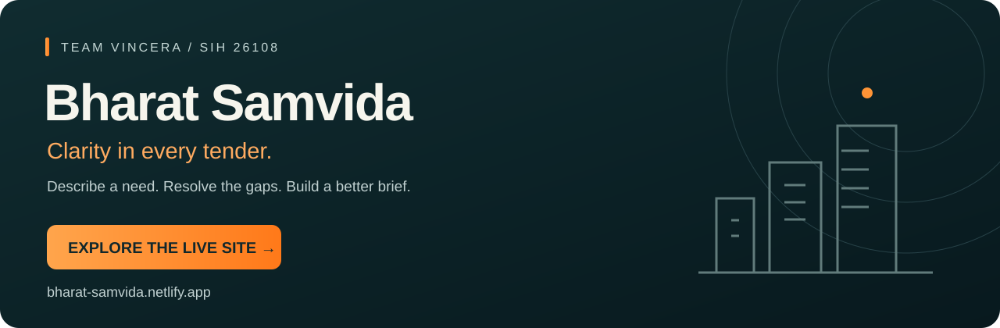
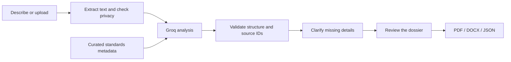

<div align="center">

<a href="https://bharat-samvida.netlify.app/">
  
</a>

# [↗ TRY THE LIVE WEBSITE](https://bharat-samvida.netlify.app/)

### [bharat-samvida.netlify.app](https://bharat-samvida.netlify.app/)

**No sign-up required · English & हिंदी · Works on phone, tablet and desktop**

[Open Tender Studio](https://bharat-samvida.netlify.app/studio) &nbsp; • &nbsp; [Explore Legal Library](https://bharat-samvida.netlify.app/library) &nbsp; • &nbsp; [Run locally](#run-locally)

**Built by Team Vincera for Smart India Hackathon · Problem Statement 26108**

</div>

---

> [!TIP]
> **The best way to understand Bharat Samvida is to use it.**
> [Visit the live website →](https://bharat-samvida.netlify.app/) Scroll through the development story, describe a procurement need, and explore a library of source documents—all without creating an account.

## Better specifications. Better places to live.

A brighter classroom. Reliable water supply. A bridge that connects communities. Every public project starts with a need—and a tender that explains it clearly.

**Bharat Samvida helps turn everyday procurement descriptions into structured, source-linked specification drafts.** It brings together AI-assisted standard discovery, focused clarification questions, and an accessible legal library so users can prepare a better brief before technical review.

The project addresses the **Department of Consumer Affairs (DoCA)** problem statement under the **Ministry of Consumer Affairs, Food & Public Distribution**. This is an independent SIH project, not an official government or BIS service.

## Three spaces. One connected experience.

| 🏫 Home | ✍️ Tender Studio | 📚 Legal Library |
| --- | --- | --- |
| Scroll through school renovation, neighbourhood development, and bridge construction. | Describe your requirement, resolve missing details, and prepare a provisional specification. | Browse **44 curated documents**, read PDFs inside the app, and download original sources. |
| [Experience the journey →](https://bharat-samvida.netlify.app/) | [Start your brief →](https://bharat-samvida.netlify.app/studio) | [Open the library →](https://bharat-samvida.netlify.app/library) |

## From “we need…” to a reviewable draft

**01 — Describe**  
Write in English or Hindi, or upload an existing PDF, DOCX, or TXT brief.

**02 — Clarify**  
Answer targeted questions with four suggested options, a custom answer, or “unknown.” Missing requirements stay visible.

**03 — Review**  
Explore standard candidates, reasons for inclusion, supporting links, and unresolved details.

**04 — Download**  
Export a **PDF, Word document, or JSON** for further review. Document sections cover tender particulars, scope, technical requirements, quality checks, commercial terms, and a financial offer schedule.

### Try this in Tender Studio

> We need water-based paint for the dry interior plaster walls of a government primary school. Help us identify suitable standards, quality checks, and the details we should specify before inviting bids.

**[Try this brief on the live website →](https://bharat-samvida.netlify.app/studio)**

## Designed to feel approachable

| Feature | Experience |
| --- | --- |
| **Scroll-driven storytelling** | A reversible journey through three development scenes, with camera-style movement and text tied to scroll progress. |
| **Emblem-to-orb animation** | A dotted loading sequence transforms into three thinking-orb treatments. |
| **English / हिंदी** | Persistent interface language, with official Hindi material where available and labelled AI-assisted reading translations where supported. |
| **Documents in context** | Category browsing, an embedded PDF reader, and original-file downloads. |
| **Anonymous drafting** | No login page; drafts use temporary sessions with an explicit deletion option. |
| **Flexible input** | Searchable PDF, DOCX, and TXT uploads up to 3 MB; PDF extraction up to 100 pages and 60,000 extracted characters. |

The current homepage flight preview animates still artwork. Hindi reading translations are not official legal translations; scanned or unextractable pages may require the original PDF.

## Behind the experience


```mermaid
flowchart LR
    A[Describe or upload] --> B[Extract text and check privacy]
    B --> C[Groq analysis]
    D[Curated standards metadata] --> C
    C --> E[Validate structure and source IDs]
    E --> F[Clarify missing details]
    F --> G[Review the dossier]
    G --> H[PDF / DOCX / JSON]
```

Groq interprets procurement intent against a curated catalogue. The server validates structured responses, filters standard IDs against the catalogue, and applies clarification answers to the server-owned draft.

> [!IMPORTANT]
> **A drafting assistant, with human review built in.** The current catalogue is a starter collection, not comprehensive BIS coverage. Latest editions, amendments, mandatory certification, and normative references are not automatically verified. Unknown details remain explicit. Exported documents are provisional drafts, not issued tenders or compliance approvals.

## Technology

| Layer | Implementation |
| --- | --- |
| Application | Next.js App Router, React, TypeScript |
| Motion | GSAP, Three.js, Thinking Orbs, canvas and CSS |
| AI | Groq SDK with server-side model calls |
| Validation | Zod schemas and catalogue/source checks |
| Documents | PDF.js, pdf-parse, Mammoth, PDFKit, docx |
| Temporary storage | In-memory locally; encrypted Netlify Blobs on Netlify |
| Hosting | Netlify with the Next.js runtime adapter |

<details>
<summary><strong>Developer guide — local setup, environment variables and deployment</strong></summary>

## Run locally

**Prerequisites:** Node.js 22, npm, and access to this repository. A Groq API key is needed for live AI mode.

```bash
git clone https://github.com/TeamVincera/bharat-samvida.git
cd bharat-samvida
npm ci
cp .env.example .env.local
```

Edit `.env.local` on your machine, then start the app:

```bash
npm run dev
```

Open [localhost:3000](http://localhost:3000).

### Environment variables

| Variable | Purpose |
| --- | --- |
| `APP_MODE` | Set to `live` for Groq analysis or `demo` for the built-in demo adapter. |
| `GROQ_API_KEY` | Your server-side Groq credential; required in live mode. |
| `GROQ_EXTRACTION_MODEL` | Initial analysis model. Default: `openai/gpt-oss-20b`. |
| `GROQ_RECOMMENDATION_MODEL` | Final review model. Default: `openai/gpt-oss-120b`. |
| `SESSION_STORAGE` | Set to `netlify` on Netlify; leave unset for local in-memory sessions. |
| `NEXT_TELEMETRY_DISABLED` | Set to `1` to disable Next.js telemetry. |

To explore without a Groq key, set `APP_MODE=demo`. Demo results are fixture-based examples, not live AI recommendations. Netlify storage depends on the hosting runtime; do not enable it for a plain local development server.

Never commit `.env.local`, paste credentials into issues, or prefix the Groq key with `NEXT_PUBLIC_`.

### Useful commands

```bash
npm test          # Acceptance and regression checks
npx tsc --noEmit  # Type checking
npm run build    # Production build
npm start        # Run the production build locally
```

Tests cover clarification handling, export validation, PDF/DOCX generation, session ownership and encryption, shared session storage, legal PDF hashes, and language/journey behaviour.

## Deploy to Netlify

The live site uses a **manual CLI deployment**. GitHub pushes do not automatically update it. The repository is public. Hosting is still configured for manual releases; making the repository public did not enable automatic deployments.

For a maintainer updating the existing site:

```bash
npm ci
npx netlify-cli login
npx netlify-cli link
npx netlify-cli deploy --prod --context production
```

Select the existing **bharat-samvida** project when linking. Keep the automatic Next.js adapter enabled. The checked-in `netlify.toml` specifies the build command, `.next` publish directory, and Node version.

Configure these variables in the Netlify project's server environment before deployment:

```text
APP_MODE=live
SESSION_STORAGE=netlify
GROQ_API_KEY=<set privately in Netlify>
```

**Always run the full Netlify build and adapter step.** Do not upload the source folder as a static site or use `--no-build` against the raw `.next` directory: the app needs server functions for AI, sessions, and exports.

The current deployment required no payment card. Netlify and Groq have separate usage allowances; check the account dashboards before increasing usage. The included `render.yaml` is an alternative single-server configuration, not the active hosting setup. Account verification requirements vary by provider.

After publishing, verify `/api/health`, submit a sample brief, answer a clarification, download a PDF/Word file, and open a legal document. Deployment guidance: [Netlify Next.js documentation](https://docs.netlify.com/build/frameworks/framework-setup-guides/nextjs/overview/).


</details>

## Privacy and session handling

- Groq credentials stay on the server and are excluded from the repository.
- Pattern-based privacy checks redact recognised sensitive values and block recognised credentials before brief analysis. These checks are not a guarantee that every sensitive value will be detected.
- Groq receives the remaining procurement text needed to answer. Redaction does not make the whole brief unreadable to the model, and this is not end-to-end encrypted AI processing.
- Anonymous sessions use random tokens in HttpOnly cookies, with Secure enabled in production and SameSite set to Strict.
- Netlify session records use AES-256-GCM encryption with a key derived from the session token. The token is not stored alongside the encrypted record.
- Access expires after 30 minutes of inactivity or two hours total. On Netlify, a scheduled cleanup runs every ten minutes to remove records past the hard expiry; actual cleanup depends on scheduled execution. Explicit session deletion removes the stored record.
- Local in-memory sessions disappear when the process restarts. This is temporary drafting storage, not a durable records system.

For application-facing details, see the [privacy page](https://bharat-samvida.netlify.app/privacy).

<details>
<summary><strong>Repository structure, contributing and credits</strong></summary>

## Repository map

```text
app/                  Pages and API routes
components/           Story, chat, clarifications, dossier and PDF reader
lib/                  AI adapters, validation, privacy, sessions and exports
data/                 Legal catalogue, standards metadata and demo fixtures
public/assets/        Brand, scene artwork and loader assets
public/pdfs/          Curated source PDFs
public/fonts/         Fonts for document rendering
netlify/functions/    Scheduled session cleanup
tests/                Acceptance and regression checks
netlify.toml          Active hosting configuration
render.yaml           Alternative single-server configuration
```

## Contributing

Keep changes focused and include a clear description of the behaviour being improved. Run the tests, type check, and production build before requesting review. For interface changes, check English and Hindi on phone and desktop. For catalogue changes, record authoritative sources and preserve the distinction between observed metadata and verified requirements.

Do not add real tender submissions, credentials, or personal data to fixtures or issues.

## Credits and rights

Built by **Team Vincera** for SIH Problem Statement 26108.

Legal documents are attributed to their issuing authorities in the catalogue and library. Their inclusion does not imply government endorsement. Third-party components, fonts, and assets retain their own terms; see the [orb attribution](public/assets/loader/ATTRIBUTION.md), [orb licence](public/assets/loader/ORB-LICENSE.txt), [font licence](public/fonts/OFL.txt), and [Mukta font licence](public/fonts/Mukta-OFL.txt).

This repository does not currently declare an open-source licence for the application code. Contact the maintainers before redistribution.

</details>

---

<div align="center">

### A clearer brief is a better beginning.

**[Explore Bharat Samvida →](https://bharat-samvida.netlify.app/)**

Made by **Team Vincera** · Clarity in every tender.

</div>
